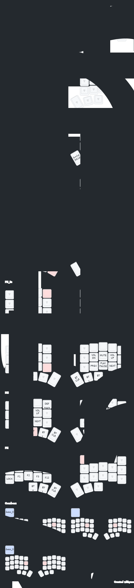

This repo contains firmware files for my custome split keyboard, The firmware is built using Stock ZMK Library And supports ZMK studio as well.

You can edit key configurations using this (https://zmk.studio/)

It has specific layers for media and mouse movements and has a specail layer for VIM as well 

The firmware is based on Stock corne config for a corne keyboard so the pinouts match the stock corne board, Since chocofi is inspired by corne layout and My split keyboard is a Chocofi Keyboard Custom made for my hand dimensions The pinouts are cross compatible with al three keyboards, however if you want to use the keymap on a corne keyboard ou'd have to reasign keys to the outer pinky columns.

## keymap 

### References
1.https://github.com/edygar/chocofi-zmk-config
2.https://zmk.dev/  
3.https://zmk.studio/  